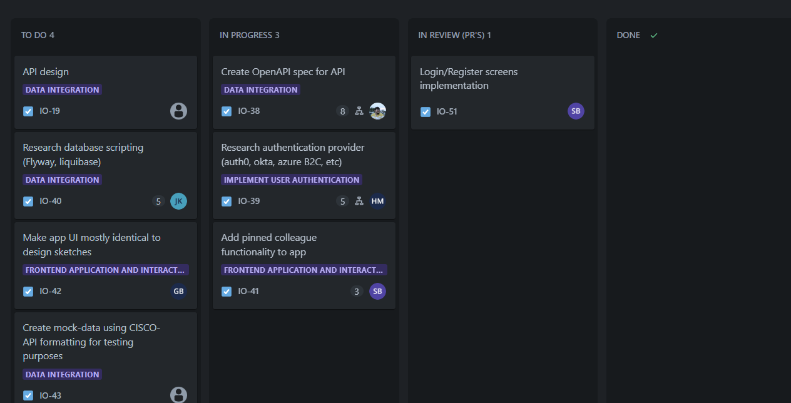

# Agile method

_Take me back to the [home](../README.md#learning-outcomes) page!_

- [Agile method](#agile-method)
  - [Description](#description)
    - [Learning outcome](#learning-outcome)
    - [Clarification](#clarification)
  - [Implementation](#implementation)
  - [Relevant questions](#relevant-questions)
    - [What are popular agile methods?](#what-are-popular-agile-methods)
    - [What are important agile principles we used?](#what-are-important-agile-principles-we-used)
    - [What method did we choose and why?](#what-method-did-we-choose-and-why)
    - [Jira](#jira)
    - [Sprints](#sprints)
    - [Story points and velocity](#story-points-and-velocity)
    - [Sprint reviews and Refinement sessions](#sprint-reviews-and-refinement-sessions)
    - [Definition of Done](#definition-of-done)

## Description

Agile methods are a set of iterative and incremental approaches to software development that prioritize flexibility, collaboration, and customer satisfaction. They emphasize adaptability to changing requirements and continuous delivery of valuable software.

    

### Learning outcome

> You choose and implement the most suitable agile software development method for your software project.

### Clarification

_Choose:_ You are aware of the most popular agile methods and their underlying agile principles. Your choice of a method is motivated and based on well-defined selection criteria and context analyses.

## Implementation

During our semester working using a agile method in our case [Scrum](#what-are-popular-agile-methods), brought about some challenges with them. Like needing to use tools like [Jira](#jira) and adapting to three-week [sprints](#sprints). However, with each iteration, our team became more proficient in utilizing these tools and embracing agile principles. Regular reviews stakeholder and teacher provided some valuable insights in how to improve as a team and where to focus on in our next sprint. After every sprint we also did a [sprint-review](#sprint-reviews). To see what went well and what needed improvement, promoting a "culture" of continuous improvement. We had some trouble with determining our [Definition of Done](#definition-of-done). So we didn't really understand how to go about it but with some help from our teachers we got a better understating on how to define it.

As we progressed through sprints, our understanding of Scrum grew, especially in the last sprint, where we efficiently managed the project with just one story point remaining. This proved we had grown as a team and found our teams [velosity](#story-points-and-velosity). Moving forward, we are well-equipped to apply Scrum more efficiently, implementing its principles for future projects. We just started working and Scrum and are not (jet) master of Scrum but have certainly come a long way. So in further projects we will grow even more in using Scrum using this semesters base for working agile.

## Relevant questions

### What are popular agile methods?

1. **Scrum:**

   - **Description:** Scrum is an iterative and incremental agile framework that focuses on delivering a potentially shippable product at the end of each iteration called a sprint, a sprint can be a period from a week to 4 weeks. It emphasizes collaboration, accountability, and continuous improvement. This is the one we used during our semester
   - **Key Components:** Product Backlog, Sprint Planning, Daily Stand-ups, Sprint Review, Sprint Retrospective.

2. **Kanban:**

   - **Description:** Kanban is a visual management method for software development that helps teams balance work-in-progress and optimize the flow of work. It is based on the principles of transparency, balance, and continuous delivery.
   - **Key Concepts:** Visual Board, Work-in-Progress Limits, Pull System.

3. **Extreme Programming (XP):**

   - **Description:** XP is an agile software development framework that aims to produce higher-quality software through frequent releases in short development cycles. It emphasizes practices such as pair programming, continuous integration, and test-driven development.
   - **Key Practices:** Pair Programming, Continuous Integration, Test-Driven Development.

4. **Lean Software Development:**
   - **Description:** Lean principles focus on delivering value to the customer with minimal waste. It emphasizes eliminating non-value-added activities and optimizing efficiency throughout the development process.
   - **Key Principles:** Eliminate Waste, Amplify Learning, Decide as Late as Possible.

### What are important agile principles we used?

In our agile journey, we used to several key principles that had influence on our workflow:

1. **Iterative Development:** We embraced the iterative nature of agile, using [refinement-session](#sprint-reviews-and-refinement-sessions) to refine our tickets and make them more detailed. and doing sprint reviews after a sprint was done. To see what went good and what needed to improve.

2. **Collaboration and Communication:** Active communication and collaboration within the team were very important. Team members consistently shared ideas, feedback, updates, code reviews and honesty was very important in our team.

3. **Customer Feedback:** Integration of feedback from stakeholders and teachers was central to our process. Regular reviews allowed us to adapt and adjust our approach based on valuable insights, ensuring alignment with project goals.

4. **Adaptability:** Agile encourages adaptability to changing requirements. We remained flexible and responsive to evolving project needs throughout the semester.

5. **Self-Organizing Teams:** Our team took ownership of tasks and responsibilities, embodying the self-organizing ethos of agile. This empowered us to make decisions collaboratively and efficiently.

6. **Continuous Improvement:** The agile mindset revolves around continuous improvement. Regular retrospectives and feedback loops enabled us to identify areas for enhancement and implement changes, contributing to our overall growth.

### What method did we choose and why?

We didn't exactly choose. We where expected from Fontys to use Scrum. Probably we asked to use another agile method then Scrum we could. but we never really questioned it so we just used Scrum.

### Jira

Jira supports any agile project management methodology for software development that your team might need.[^1] From agile planning to fully customizable Scrum boards, Jira gives you the tools you need to estimate, report and measure velocity with workflows designed to fit your frameworks.projects.

We used Jira this semester and can recommend it to anyone. for more info on Jira software click [here](https://www.atlassian.com/software/jira/guides/getting-started/introduction#what-is-jira-software).

    

### Sprints

In Scrum, a sprint is a time-boxed iteration, typically lasting two to four weeks, during which a cross-functional team works on a set of defined tasks and delivers a potentially shippable product increment. Sprints provide a structured framework for iterative development and allow teams to regularly review and adapt their work based on feedback.

### Story points and velocity

In Scrum, story points are a relative measure of effort or complexity assigned to user stories during estimation. Velocity is the average amount of work a team can complete in a sprint based on the sum of story points. It helps teams forecast how much work they can handle in future sprints.

### Sprint reviews and Refinement sessions

Sprint reviews in Scrum are meetings held at the end of each sprint where the development team showcases the completed work to stakeholders. It's an opportunity for feedback, discussion, and collaboration to ensure the product aligns with expectations and goals.

A refinement session in Scrum is a regular meeting where the team reviews and clarifies upcoming backlog items. It involves discussing details, estimating effort, and ensuring that user stories are well-defined and ready for inclusion in future sprints.

### Definition of Done

Definition of Done (DoD) in Scrum is a set of criteria or standards that must be met for a user story or product increment to be considered complete. It ensures that the work meets the team's quality standards and is ready for delivery. The DoD is agreed upon by the Scrum team and helps maintain consistency and transparency in the development process.

    

[^1]: https://www.atlassian.com/software/jira/guides/getting-started/introduction#what-is-jira-software
