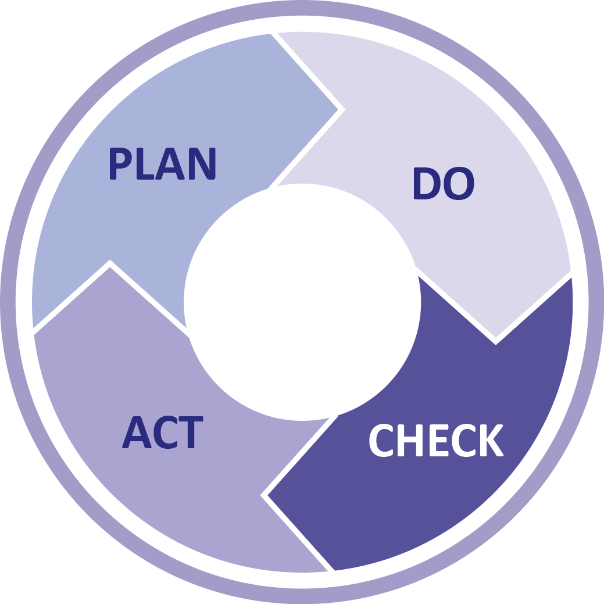

# Business processes

_Take me back to the [home](../README.md#learning-outcomes) page!_

- [Business processes](#business-processes)
  - [Description](#description)
    - [Learning outcome](#learning-outcome)
    - [Clarification](#clarification)
  - [Implementation](#implementation)
    - [Diagram 1 - the 'old' situation](#diagram-1---the-old-situation)
    - [Diagram 2 - the 'new' situation](#diagram-2---the-new-situation)
  - [Relevant questions](#relevant-questions)
    - [Why is it important to show alternative paths?](#why-is-it-important-to-show-alternative-paths)

## Description

    

### Learning outcome

> You analyze and describe simple business processes that are related to your project.

### Clarification

_Simple:_ Involving stakeholders, predominantly sequential processes with one or two alternative paths.

_Related:_

- **Business processes during which the software that you are developing will be used (business processes that the software must support by fully or partially automating them).**

or

- ~~Business processes needed for the success of your software development project (e.g., product release, market release, financial assurance).~~

## Implementation

This learning outcome is most prevalent in the group project, as here it is most crucial to be able to communicate the potential paths, solutions and problems to the stakeholder. Failure to do so could result in longer development cycles, mismatches of expectations and actual implementations etc. The diagrams' result is a diagram with, in this case, an old and improved path.

### Diagram 1 - the 'old' situation

This involves the 'old' path, which is a flow of the general goal 'Find and talk to a colleague' without involving an external component such as an web application. As visible in the diagram, colleague 1 (top lane) is searching for colleague 2 (bottom lane), 1 is very dependant of 2, they need to ask where they are, wait for then to finish up tasks and it's very time consuming/dependant which can lead to frustration on both ends of the spectrum. As colleague 1 you don't want to be _constantly_ bothering your colleagues. On the other hand colleague 2 is constantly getting pulled out of concentration, pinged or messaged which can be very distracting. Overall this way of finding and meeting with a colleague is rather inefficient.

### Diagram 2 - the 'new' situation

So what can be done to improve the situation? The dependency of colleague 2 is removed from the interaction for the most part. Colleague 1 is not dependant on 2 for information such as their location, whether or not they are working remote and whether or not colleague 2 is busy. The major benefit of improving the interaction this way is a significant reduction of interactions necessary to find time to work with one another. Any reduction of interactions in this scenario is a benefit as it leads to less distractions, shorter waiting times and no unnecessary searching around the office.

## Relevant questions

### Why is it important to show alternative paths?

The value of showing alternative paths is not only to indicate options to the involved personnel (teammates, POs, stakeholders etc.) but also relevant to consciously think whether or not the current path is the 'correct' one. By creating alternatives the option of better (-or worse) choices are discovered, talked about and if deemed necessary completely removed. It makes it easier to explore alternatives by discussing these prior to the actual implementation.
