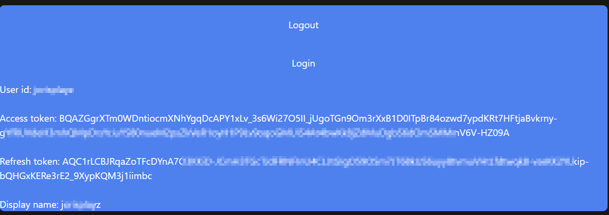

# How can a developer enhance security for user accounts sharing their Spotify WebAPI data in the SpottedCharts application?

Researched and documented by J.A Brugman and Morris Hannessen

## Table of contents

- [How can a developer enhance the security of accounts sharing data using the Spotify WebAPI?](#how-can-we-enhance-the-security-of-accounts-sharing-data-using-the-spotify-webapi) - [By J.A Brugman \& Morris Hannessen](#by-ja-brugman--morris-hannessen)
  - [Table of contents](#table-of-contents)
  - [Introduction](#introduction)
  - [What do user accounts encompass?](#what-do-user-accounts-encompass)
  - [What are some of the security concerns regarding accounts?](#what-are-some-of-the-security-concerns-regarding-accounts)
  - [What kind of security does the Spotify WebAPI implement?](#what-kind-of-security-does-the-spotify-webapi-implement)
  - [Proof of concept (PoC)](#proof-of-concept-poc)
  - [Summary/Conclusion](#summaryconclusion)
  - [References](#references)

## Introduction

In the vast world of the internet, security is something almost everyone faces.
Especially for folks like software engineers, architects, and project leads,
it's a common challenge. Security issues can be as simple as dealing with things like [SQL injection]() or using a 'regular' insecure http page.[^5]

This document is all about looking into how to make things more secure and protect
user data for those who use or are involved with the [Spotify Web API](https://developer.spotify.com/documentation/web-api).

To answer this question it is necessary to take a deeper look into basic security measures,
how to implement these and what value they can add.
In the conclusion, a suggestion will be put forth regarding the 'SpottedCharts' application's implementation. Together with this implementation a
'proof of concept' (Poc) will be made.

## What do user accounts encompass?

User accounts are a collection of data from potentially different sources all merged together. These are also called individuals or profiles, typically a user account is made/implemented to ensure a user should(-n't) have access to a source of information. Accounts often have a username or ID to identify the user, these users are then secured using a password or passkey to verify the identity. It is a mean of personalizing and and securing certain interactions with a system on behalf of a person. They allow features such as custom settings, access to specific resources which are otherwise inaccessible and (-in some cases) manipulate/contribute data in a system/platform.

## What are some of the security concerns regarding user accounts?

In the world of user accounts there are several limitations and security concerns to account for. Storing and managing user accounts is inherently insecure, risky and there are several privacy concerns related to saving such data.

Users can create weak passwords, this can then be mitigated by enforcing certain password standards. Loopholes or missed security issues are also potential risks in the integrity of the application. If a users' data does leak it can have severe consequences for both the user and developer. You can lose data, users' information such as first- and last name, adres information, emails etc are then shared/sold on the web. Other risks are as follows:

- Unauthorized access - The risk of users gaining access/control over a resource they should NOT be able to access.
- Account hijacking - The threat of an external users, often times a hacker, scammer of phisher, taking over an account by means of earlier accessed information
- Session hijacking - Concerns of sessions not being timed to a certain scope, allowing unauthorized users to use cookies to take over a session without ever logging in.
- Phishing - By saving accounts it is much easier for an email about a 'old password' or 'unsecured account' to be believed instead of immediately being deleted.

By acknowledging these concerns, both developers and users are ensured a smooth product and experience.

## What kind of security does the Spotify WebAPI implement?

As Spotify states in their API documentation[^1]:

> Spotify implements the OAuth 2.0 authorization framework:
> </BR>  > </BR> Where: </BR>- End User corresponds to the Spotify user. The End User grants access to the protected resources (e.g. playlists, personal information, etc.) </BR>- My App is the client that requests access to the protected resources (e.g. a mobile or web app). </BR>- Server which hosts the protected resources and provides authentication anD authorization via OAuth 2.0.

OAuth is a protocol originally developed by the 'OAuth discussion group' after a Twitter developer found there was not standard developed for an implementation regarding third-party ID access. After a while Google took interest and joined this group before drafting the first internal specification. This was then put forward during the meeting at the 73rd edition of the Internet Engineering Task Force (IETF), November 2008. In January 2013 OAuth 2.0 was released by the IETF. Today this form of authentication is very popular amongst large ICT companies such as: Google, Amazon, Twitter & Microsoft. In Twitter (X) all third-party applications are only able to access user data via an OAuth 2.0 framework.

There are 4 major grant types in the OAuth 2.0:

- Authorization Code
- PKCE
- Client Credentials
- Device Code

Spotify implements all four of these flows in the following flows: [^4]

> | FLOW                         | Access User Resources | Requires Secret Key (Server-Side) | Access Token Refresh |
> | ---------------------------- | :-------------------: | :-------------------------------: | :------------------: |
> | Authorization code           |          Yes          |                Yes                |         Yes          |
> | Authorization code with PKCE |          Yes          |                No                 |         Yes          |
> | Client credentials           |          No           |                Yes                |          No          |
> | Implicit grant               |          Yes          |                No                 |          No          |

These flows describe the form of authentication which a implement to access information on behalf of a user. Within the 'SpottedCharts'[^2] application the 'Authorization code' flow is used. If the user allows the scopes/application, the (simplified-) flow works as follows:

1. Request authorization via the user2
   - Display to the user the scopes which the application is requesting access to.
   - The user logs in
2. Request the access tokens from the Spotify Web API
3. Use the returned access token to access protected resources defined earlier within the scopes of the application.
4. If the request is timed-out it means the access token has expired, use the refresh token to gain a new access token.


The benefit of accessing data through these means it that it is a 2-way handshake. The user has to allow the access to the data, but to give that access is not required to work through the application itself, instead the third-party, in this case Spotify is responsible for this. This leads to a system of trust, the user is familiar with the application and it is clear that you are giving application X access to Spotify.

Another benefit of using a third-party application is that the application you are developing is required to save, maintain or secure 'personal' account data. The application simply accesses the third party for all that information, it does not have to

- Handle passwords
  - Encryption
  - Resetting
  - Validation
  - Security
- Handle sessions
  - Hijacking is harder (timed sessions)
- Save user information such as email addresses, profile photos etc

To access user data, you store, in your chosen storage, the user account and the associated ID provided by Spotify.

### What are the risks associated with Spotify's WebAPI security measures?

The OAuth 2.0 authorization framework comes with it's risks. Some of the more common issues are as follows:

- Phishing
- Redirection interception
- Clickjacking

Redirection interception is an issue that arises in OAuth by creating a fake representation of the scopes/login external page. Simply intercept the endpoint and redirect the user to a 'fake' auth grant, this leads a user who is not paying attention filling in their username and/or password, thus stealing their data. To prevent this you want to ensure that the URL is the one which you expected to enter your code into, in this scenario that means 'www.spotify.com'.

<div>
  
  
</div>

_The login/scope screen when going through the Spotify authorization flow_

Clickjacking is the principle of tricking a user intro clicking/accepting something different than what they are perceiving. In this scenario that could mean loading a frame over the Spotify login (see image) page. Thus tricking a user to clicking/typing into something very different from what they observe. To prevent this one should ensure they are on the domain they need to be on, 'www.spotify.com' and not that Spotify is being loaded through an external source such as an Iframe.

## Proof of concept (PoC)

For the POC we shall use the Spotify 'authorization' code flow.[^3]

Step 0 - Prerequisites

To retrieve the profile information from our user. We first need to register an application on the Spotify Dashboard, we need the ID and secret. As these provide the information for Spotify to figure out which application is trying to access information on the user' behalf. Here we shall also define our 'callback' URL. This URL is used to return the user to after Spotify has verified/denied the request to get access. We built this application in React NextJS.


</br>

Step 1 - Send the user to the Spotify login/scoped screen.

```js
  getAuthorizationToken: () => {
    const STATE = "your_random_state";
    const SCOPES = "user-read-private";
    const LOGIN_URL = `https://accounts.spotify.com/authorize?client_id=${secrets.CLIENT_ID}&redirect_uri=${secrets.REDIRECT_URI}&scope=${SCOPES}&response_type=code&state=${STATE}`;
    window.location.href = LOGIN_URL;
  },
```

Step 2 - Handle the called back data, pass the authorization code to the next step.

```js
//Get parameters from URL.
const urlParams = new URLSearchParams(window.location.search);
const code = urlParams.get("code");

//If code is in the URL, means the request was successful.
if (code) {
  //get and set the access token using the authorization code.
  SpotifyService.setAccessToken(code)
    .then(() => {
      refreshAccessToken();
    })
    .catch((error) => {
      console.error("Error setting access token:", error);
    });
}
```

Step 3 - Request an access token with the returned authorization code.

```js
  setAccessToken: async function (authorizationCode) {
    //Create the body to get an access token from the authorization code.
    const requestBody = new URLSearchParams();
    requestBody.append("grant_type", "authorization_code");
    requestBody.append("code", authorizationCode);
    requestBody.append("redirect_uri", secrets.REDIRECT_URI);

    //Make a request to the token endpoint to set the access token to local storage.
    await this.setAccessRefreshToken(requestBody);
  },

  setAccessRefreshToken: async (requestBody) => {
    //Encode the client ID + Secret and add it to the header.
    const headers = {
      Authorization:
        "Basic " +
        new Buffer.from(
          secrets.CLIENT_ID + ":" + secrets.CLIENT_SECRET
        ).toString("base64"),
      "Content-Type": "application/x-www-form-urlencoded",
    };

    //Make a request to the token endpoint with the body parameters.
    axios
      .post(SPOTIFY_TOKEN_ENDPOINT, requestBody, { headers })
      .then((response) => {
        //Set the access & refresh tokens.
        localStorage.setItem("accessToken", response.data.access_token);
        localStorage.setItem("refreshToken", response.data.refresh_token);
      })
      .catch((error) => {
        //Oops.
        console.error("Error while fetching access token:", error);
      });
  },
```

Step 4 - Ensure the access and refresh tokens are valid. In this example this is tested by doing a /me request in Spotify, returning the users' Spotify profile. (This was specified in the earlier scopes.) If the access token is expired a new one is requested.

```js
checkAndRefreshAccessToken: async () => {
    //If the accessToken does not have a value it means something went wrong or it's invalid. Try to get a new access token.
    const accessToken = localStorage.getItem("accessToken");
    if (!accessToken) {
      SpotifyService.getAuthorizationToken();
      return;
    }

    //Add the (new-) access token to the header for the API call.
    const headers = {
      Authorization: `Bearer ${accessToken}`,
    };

    //Request the user Id and display name from the Spotify API.
    try {
      await axios
        .get(SPOTIFY_API_ENDPOINT, { headers })
        .then((response) => {
          //Set the values from the Spotify API.
          localStorage.setItem("userId", response.data.id);
          localStorage.setItem("displayName", response.data.display_name);
        })
        .catch(function (error) {
          //Catch the errors, the most common error is the accessToken being expired

          if (error.response) {
            //Log the caught error
            console.log(error.response.data);

            //Get the refresh token from the storage.
            const refreshToken = localStorage.getItem("refreshToken");

            //Create a new body to request a new access token using the refresh token.
            const requestBody = new URLSearchParams();
            requestBody.append("grant_type", "refresh_token");
            requestBody.append("refresh_token", refreshToken);

            //Hand the body down to the token refresh function.
            this.setAccessRefreshToken(requestBody);
          } else {
            console.log("Error", error.message);
          }
        });
    } catch (error) {
      console.error("Error while checking or refreshing access token:", error);
    }

    //Navigate back to the index url.
    const homePageURL = `http://localhost:3000/`;
    window.location.href = homePageURL;
  },
```

Step 5 (EXTRA) - Code to refresh the access token by using the same function with different parameters.

```js
setAccessRefreshToken: async (requestBody) => {
    //Encode the client ID + Secret and add it to the header.
    const headers = {
      Authorization:
        "Basic " +
        new Buffer.from(
          secrets.CLIENT_ID + ":" + secrets.CLIENT_SECRET
        ).toString("base64"),
      "Content-Type": "application/x-www-form-urlencoded",
    };

    //Make a request to the token endpoint with the body parameters.
    axios
      .post(SPOTIFY_TOKEN_ENDPOINT, requestBody, { headers })
      .then((response) => {
        //Set the access & refresh tokens.
        localStorage.setItem("accessToken", response.data.access_token);
        localStorage.setItem("refreshToken", response.data.refresh_token);
      })
      .catch((error) => {
        //Oops. :(
        console.error("Error while fetching access token:", error);
      });
  },
```

Implementing this code in a NextJS web-application and creating an index and callback screen it is then possible to print our newly accessed data and tokens to the screen.



_Data is obscured due to privacy concerns_

## Conclusion

Whilst OAuth 2.0 carries it's flaws and problems, they are more easily mitigated then creating your own system. It takes less effort, time and resources. There is no need to spend any extra resources on security and privacy and there are fewer risks within your application regarding data leaks, local/global privacy laws etc. To answer our main question 'How can a developer enhance security for user accounts sharing their Spotify WebAPI data in the SpottedCharts application?':

A developer has the choice to implement the Spotify API, as these use an OAuth 2.0 based API authentication system there is no need to store user data such as usernames, passwords, emails etc. and it is easier to main focus on other topics and/or choices in development. You can associate data to a user ID which is inherently so obscure and not easily-traced back to a single individual. The risk and data is carried by the provider, in this case, Spotify.

## Sources

[Cloudflare](https://www.cloudflare.com/)

[^1]: https://developer.spotify.com/documentation/web-api/concepts/authorization
[^2]: https://github.com/S3-Software-IP/monorepo
[^3]: https://developer.spotify.com/documentation/web-api/tutorials/code-flow
[^4]: https://developer.spotify.com/documentation/web-api/concepts/access-token
[^5]: https://www.cloudflare.com/learning/ssl/why-is-http-not-secure/
